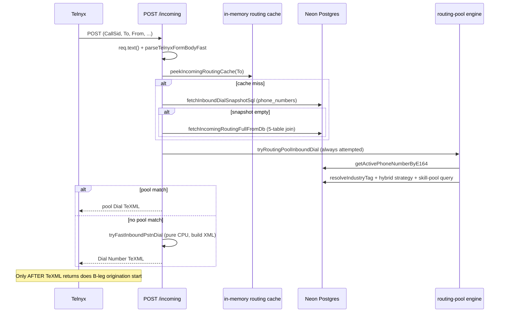

# Lyncr Inbound Call Routing — Pipeline Audit

**Generated:** 2026-06-07  
**Purpose:** Baseline inventory of synchronous work before Telnyx receives the `<Dial>` TeXML — diagnose dead-air silence before the receptionist's cell begins ringing.  
**Scope:** Webhook handler, DB/cache calls, whisper engine. No code changes in this document.

---

## Executive summary

| Finding | Detail |
|---------|--------|
| Main webhook | `POST /api/voice/telnyx/incoming` (`app/api/voice/telnyx/incoming/route.ts`) |
| Pre-ring dead air | Almost entirely **server time before TeXML returns** + Telnyx B-leg origination |
| Whisper engine | **Zero DB** — pure string logic; runs **after** receptionist answers, not before ring |
| Likely bottleneck | **`tryRoutingPoolInboundDial()` runs on every fast-path call** before direct `<Dial>` (2–4 extra Neon round trips) |
| Organizations / schedules | **Not queried** on inbound path |
| Middleware | Voice webhooks excluded from auth/session (`middleware.ts`) |

---

## 1. Inbound webhook route — synchronous operations

### Entry point

**File:** `app/api/voice/telnyx/incoming/route.ts`  
There is no separate `/api/webhook/texml` route — Telnyx hits this URL directly.

```typescript
export async function POST(req: NextRequest) {
  const perfStart = performance.now()
  try {
    return await processInboundPost(req, perfStart)
  } finally {
    const executionTime = performance.now() - perfStart
    console.log(`${executionTime.toFixed(2)}ms - voice-webhook-exec - ${req.nextUrl.pathname}`)
  }
}
```

### `processInboundPost` flow

```typescript
async function processInboundPost(req: NextRequest, perfStartMs: number): Promise<NextResponse> {
  const raw = await req.text()                              // [SYNC] read body
  fields = parseTelnyxFormBodyFast(raw)                     // [SYNC] parse subset of fields
  const hot = await tryFastInboundReceptionistResponse(fields, perfStartMs)
  if (hot) return hot

  fields = parseTelnyxFormBody(raw)                           // [SYNC] full body parse if fast missed
  const hot = await tryFastInboundReceptionistResponse(fields, perfStartMs)
  if (hot) return hot

  const out = await handleIncomingCall(...)                 // [SYNC] slow path — many DB calls
  return new NextResponse(texmlResponseBody(out), ...)
}
```

**Module init:** `warmDatabasePool()` runs once on cold start to pre-open Neon connections.

### Two return paths

| Path | When | Typical latency drivers |
|------|------|-------------------------|
| **Fast path** | `tryFastInboundReceptionistResponse()` succeeds | 1–4+ Neon queries; routing-pool probe on **every** call |
| **Slow path** | Fast path returns `null` | Full 5-table join + optional overlay + optional `getReceptionist()` + AI assistant provisioning |

### Fast path internal sequence



### What the fast path returns (standard receptionist cell forward)

Built by `buildFastReceptionistDialTexml()` in `lib/telnyx-inbound-media-quality.ts`:

- `<Dial answerOnBridge="true" ringTone="us" timeout="…" action="…/fallback/…">`
- `<Number url="…/receptionist-answer?…">` → Press-1 screen + HUD pop **on answer**
- **No `<Say>` before `<Dial>`** — intentionally minimal TeXML

Call log insert is deferred via Next.js `after()` — **not** blocking the response.

### Related webhook routes (post-answer / fallback — not pre-ring)

| Route | Purpose | Blocks initial `<Dial>`? |
|-------|---------|----------------------------|
| `/api/voice/telnyx/receptionist-answer` | Press-1 gate + HUD broadcast when receptionist answers | No |
| `/api/voice/telnyx/receptionist-screen` | Whisper phrase on callee leg (owner path) | No |
| `/api/voice/telnyx/fallback/*` | No-answer → owner / AI / voicemail | No |
| `/api/voice/telnyx/status` | Call completion logging | No |

---

## 2. Database / cache calls before `<Dial>`

### Routing lookup — `getIncomingRoutingForVoiceWebhook`

**File:** `lib/db.ts`  
Voice webhooks use a dedicated 3-tier resolver (skips Next.js `unstable_cache`):

```typescript
export async function getIncomingRoutingForVoiceWebhook(toNumber: string) {
  // 1. In-memory cache (1 hour TTL) — 0ms
  const mem = incomingRoutingCache.get(normalized)
  if (mem && mem.expiresAt > Date.now()) return mem.value

  // 2. Denormalized snapshot on phone_numbers — single indexed row
  const snap = await fetchInboundDialSnapshotSql(normalized)
  if (snap) { storeIncomingRoutingInMemory(...); return snap }

  // 3. Full join fallback — expensive
  return fetchIncomingRoutingByNumberFromDb(normalized, digitKey)
}
```

#### Tier 1 — in-memory cache

- **Key:** normalized E.164 of called number
- **TTL:** `INCOMING_ROUTING_CACHE_TTL_MS = 3_600_000` (1 hour)
- **Populated:** after any successful DB routing read; also via `primeIncomingRoutingCache()` on dashboard save

#### Tier 2 — fast snapshot (preferred)

Single query on `phone_numbers` where `number = E.164` and `inbound_routing_updated_at IS NOT NULL`:

```sql
SELECT
  pn.user_id,
  pn.number AS primary_phone_number,
  pn.inbound_dial_e164 AS receptionist_phone,
  pn.inbound_receptionist_id AS selected_receptionist_id,
  pn.inbound_receptionist_name AS receptionist_name,
  COALESCE(pn.inbound_fallback_type, 'owner') AS fallback_type,
  COALESCE(pn.inbound_ring_timeout_seconds, 30) AS ring_timeout_seconds,
  COALESCE(pn.inbound_ai_ring_owner_first, false) AS ai_ring_owner_first,
  COALESCE(pn.inbound_account_status, 'active') AS account_status,
  to_jsonb(pn) ->> 'inbound_routing_endpoint' AS inbound_routing_endpoint,
  to_jsonb(pn) ->> 'inbound_sip_username' AS inbound_sip_username
FROM phone_numbers pn
WHERE pn.status = 'active'
  AND pn.number = ${normalized}
  AND pn.inbound_routing_updated_at IS NOT NULL
  AND NULLIF(trim(pn.inbound_dial_e164), '') IS NOT NULL
LIMIT 1
```

**No join** to `users`, `organizations`, or live `receptionists` row.

#### Tier 3 — full join (cache/snapshot miss)

```sql
FROM phone_numbers pn
JOIN users u ON u.id = pn.user_id
LEFT JOIN onboarding_profiles op ON op.user_id = u.id
LEFT JOIN LATERAL (
  SELECT rc.* FROM routing_config rc
  WHERE rc.user_id = u.id AND rc.business_number IS NOT NULL
    AND (exact or digit match on business_number)
  ORDER BY rc.updated_at DESC NULLS LAST LIMIT 1
) rc_spec ON true
LEFT JOIN routing_config rc_def
  ON rc_def.user_id = u.id AND rc_def.business_number IS NULL
LEFT JOIN receptionists reff ON reff.id = COALESCE(
  rc_spec.selected_receptionist_id, rc_def.selected_receptionist_id
)
WHERE pn.status = 'active' AND (pn.number = $1 OR digit match...)
LIMIT 1
```

**Tables touched:** `phone_numbers`, `users`, `onboarding_profiles`, `routing_config` (×2 via LATERAL + default), `receptionists`.

**Not queried:** `organizations`, business hours, DND, schedules, `team_invites`, 10DLC tables.

After a full join, async `writeInboundRoutingSnapshot()` backfills `phone_numbers.inbound_*` columns so the next call hits tier 2.

### Routing pool probe — runs on every fast path call

Even when a direct receptionist is configured, **`tryRoutingPoolInboundDial()` is always awaited first**:

```typescript
// app/api/voice/telnyx/incoming/route.ts — tryFastInboundReceptionistResponse
const poolDial = await tryRoutingPoolInboundDial({ routing, ... })
if (poolDial) return poolDial

const fast = tryFastInboundPstnDial({ routing, ... })
```

**`tryRoutingPoolInboundDial` synchronous chain:**

1. `getActivePhoneNumberByE164(businessLineE164)` — `phone_numbers` lookup (regexp digit match)
2. `getAvailableReceptionistsForLine(line.id)` which chains:
   - `getPhoneNumberLineById`
   - `resolveIndustryTagForLine` → up to 3 queries (`phone_numbers.industry_tag`, `routing_config` ×2, `users.industry`)
   - `getLineHybridRoutingStrategy`
   - `listAvailablePlatformReceptionistsForIndustryTag` — heavy join on `receptionists` + `users` + `receptionist_badges` + **`call_logs` NOT EXISTS** (live-call busy check)

If the line has no `industry_tag`, pool returns `null` after step 2 — but you still pay **2–4 round trips** before the direct `<Dial>` is built.

### Slow path extras — `handleIncomingCall`

Only reached when fast path fails. Additional parallel fetch:

```typescript
await Promise.all([
  getUserAccountStatus(routing.user_id),           // if not already in join
  isTelnyxInboundDialCallerLegDone(callSid),       // repeat-leg guard
  getRoutingConfigForNumber(...),                  // if ZING_INBOUND_ROUTING_CFG_OVERLAY=1
  getReceptionist(selectedReceptionistId),         // if phone missing from join
])
```

Optional AI direct path adds:

- `getUser()` — full `users` row
- `ensureTelnyxVoiceAiAssistant()` — **Telnyx REST API** call
- `bumpTelnyxAiIncomingHitCount()` — DB write

### Caching summary

| Layer | TTL | Used on voice webhook? |
|-------|-----|------------------------|
| `incomingRoutingCache` (in-memory Map) | 1 hour | Yes |
| `phone_numbers.inbound_*` snapshot columns | Until dashboard save / resync | Yes (tier 2) |
| Next.js `unstable_cache` (`getIncomingRoutingByNumber`) | 120s | **No** — voice webhook bypasses it |
| Redis | — | Not used |

### Env flags that affect latency

| Env var | Default | Effect |
|---------|---------|--------|
| `ZING_INBOUND_ROUTING_CFG_OVERLAY` | off | When `1`: disables fast path; adds second `routing_config` read on slow path |
| `ZING_INBOUND_EARLY_MEDIA` | off | Two-pass redirect (disabled by default — can block forwarding) |
| `ZING_INBOUND_RECEPTIONIST_WHISPER` | on | Disables whisper phrase on slow owner path only |
| `ZING_RECEPTIONIST_PRESS1_SCREEN` | on | Press-1 gate on answer (post-ring, not pre-ring) |

---

## 3. Whisper phrase engine

**File:** `lib/inbound-line-whisper.ts`

```typescript
export function buildInboundLineWhisperPhrase(
  phoneLineLabel: string,
  phoneLineFriendlyName: string,
  businessLineE164: string
): string {
  const lbl = phoneLineLabel.trim()
  if (lbl && lbl.toLowerCase() !== "main line") {
    return sanitizeWhisperPhrase(lbl)
  }
  const fn = phoneLineFriendlyName.trim()
  if (fn) return sanitizeWhisperPhrase(fn)
  const digits = businessLineE164.replace(/\D/g, "")
  const last4 = digits.slice(-4)
  if (last4.length === 4) {
    return sanitizeWhisperPhrase(last4.split("").join(" "))
  }
  return "Incoming call"
}
```

- **Zero DB hits**
- **Zero external API calls**
- Inputs come from fields already on the routing row (`phone_line_label`, `phone_line_friendly_name`)

### When whisper actually runs

| Scenario | When whisper plays | Blocks pre-ring `<Dial>`? |
|----------|-------------------|---------------------------|
| **Fast receptionist PSTN path** | **Not before ring** — `buildReceptionistAnswerUrl()` called **without** `whisper` param | No |
| **Slow path → owner leg** | After owner answers via `/receptionist-screen?p=…` | No |
| **Receptionist answers** | `/receptionist-answer` — Press-1 gate + optional whisper **after pickup** | No |

Whisper is **not** in the critical path before TeXML is returned.

### Press-1 screening (post-answer)

**File:** `app/api/voice/telnyx/receptionist-answer/route.ts`

When receptionist's cell answers, Telnyx fetches the `<Number url="…">` document:

1. Plays "Lyncr Alert. Incoming call for {business}. Press 1 to connect." inside `<Gather>`
2. On press 1 → empty TeXML → bridge caller + `handleCallConnected` HUD broadcast
3. On timeout/wrong key → hang up B-leg → caller falls to fallback chain

Disabled with `ZING_RECEPTIONIST_PRESS1_SCREEN=0`.

---

## 4. Full synchronous timeline (typical receptionist cell forward)

```
Telnyx POST /api/voice/telnyx/incoming
│
├─ [SYNC] Read & parse request body (~1–5ms)
├─ [SYNC] peekIncomingRoutingCache(To)
│     └─ miss → Neon: fetchInboundDialSnapshotSql OR full join (20–200ms+ cold)
├─ [SYNC] Account suspended check (from routing row — no extra query)
├─ [SYNC] tryRoutingPoolInboundDial          ← likely bottleneck
│     ├─ getActivePhoneNumberByE164          (Neon ~20–80ms)
│     ├─ resolveIndustryTagForLine           (0–3 Neon queries)
│     └─ listAvailablePlatformReceptionists  (heavy join if tag exists)
├─ [SYNC] tryFastInboundPstnDial             (CPU only — builds XML)
└─ [SYNC] Return TeXML to Telnyx
      │
      ▼  ← caller may hear silence HERE if answerOnBridge ringback hasn't started yet
Telnyx processes TeXML, originates PSTN B-leg to receptionist cell
      │
      ▼
Receptionist cell starts ringing
      │
      ▼  (only after they answer)
GET/POST /api/voice/telnyx/receptionist-answer  → Press 1 + HUD broadcast
```

### TeXML attributes on fast `<Dial>` (caller-side ringback during B-leg setup)

From `lib/telnyx-inbound-media-quality.ts`:

- `answerOnBridge: true` — caller not bridged until B-leg answers
- `ringTone: "us"` (or custom `ZING_INBOUND_DIAL_RINGBACK_AUDIO_URL`)
- `timeout` — capped at 20s when AI fallback is configured (`ZING_INBOUND_AI_DIAL_TIMEOUT`)
- `preferred_codecs: PCMU`, optional `rtp_symmetric`

---

## 5. Likely lag sources (ranked)

1. **Routing pool probe on every call** — 2–4 Neon round trips before direct `<Dial>`, even when account uses a single assigned receptionist and no skill pool.
2. **Cold snapshot / full join** — first call after deploy or routing change hits the 5-table join until `inbound_*` snapshot is written.
3. **Neon cold connection** — mitigated by `warmDatabasePool()` but first real query can still stall on serverless cold start (Vercel `iad1` region set on route).
4. **`ZING_INBOUND_ROUTING_CFG_OVERLAY=1`** — disables fast path entirely; adds `getRoutingConfigForNumber` on slow path.
5. **Telnyx B-leg origination** — after TeXML returns; not controllable in app code. `answerOnBridge` + `ringTone="us"` already gives caller ringback during B-leg setup.

**Not a factor for pre-ring silence:** whisper engine, organizations, schedules, team tables, 10DLC lookups.

---

## 6. Diagnostic checks

### Vercel log search (per affected call)

| Log key | Meaning |
|---------|---------|
| `voice-webhook-exec` | Total handler time — should be **< 100ms** on hot path |
| `telnyx-incoming-fast-recv-path` | Fast path taken; check `lookupMs` and `routingSource` |
| `telnyx-incoming-routing-pool-dial` | Pool intercepted call (unexpected if fixed receptionist assigned) |
| `telnyx-incoming-fast-recv-dial` | Direct PSTN dial XML returned |
| `routingSource: "memory"` | Zero DB routing lookup |
| `routingSource: "db"` | Neon query on routing lookup |

### Verify snapshot is warm (Neon SQL Editor)

```sql
SELECT
  number,
  inbound_dial_e164,
  inbound_receptionist_id,
  inbound_receptionist_name,
  inbound_fallback_type,
  inbound_routing_updated_at,
  industry_tag
FROM phone_numbers
WHERE number = '+1XXXXXXXXXX';
```

`inbound_routing_updated_at` should be non-null after any dashboard routing save. If null, every call hits the full join until backfill completes.

### Re-warm cache after routing change

Dashboard saves trigger `syncInboundDialSnapshotForUser()` / `primeIncomingRoutingCache()` — confirm routing saves succeed without error.

---

## 7. Recommended optimization (not yet implemented)

**Skip `tryRoutingPoolInboundDial()` when the routing snapshot already has a direct target:**

If `routing.inbound_dial_e164` (or `receptionist_phone`) is set and `selected_receptionist_id` is present, skip the pool probe and go straight to `tryFastInboundPstnDial()`.

This removes 2–4 synchronous DB round trips from every inbound call on accounts with a fixed receptionist assignment.

Only run pool probe when:

- Line has `industry_tag` set, OR
- No direct receptionist phone on the snapshot row

---

## 8. Key file index

| Concern | File |
|---------|------|
| Main inbound webhook | `app/api/voice/telnyx/incoming/route.ts` |
| Fast `<Dial>` XML builder | `lib/telnyx-inbound-media-quality.ts` |
| Routing lookup + snapshot | `lib/db.ts` → `getIncomingRoutingForVoiceWebhook`, `fetchInboundDialSnapshotSql`, `fetchIncomingRoutingFullFromDb` |
| Skill pool matching | `lib/routing-pool.ts` → `getAvailableReceptionistsForLine` |
| Whisper phrase (no DB) | `lib/inbound-line-whisper.ts` |
| Press-1 on answer | `app/api/voice/telnyx/receptionist-answer/route.ts` |
| Whisper on owner leg | `app/api/voice/telnyx/receptionist-screen/route.ts` |
| Answer URL builder | `lib/receptionist-answer-url.ts` |
| Snapshot backfill on save | `lib/db.ts` → `writeInboundRoutingSnapshot`, `syncInboundDialSnapshotForNumber` |

---

*End of audit — ready for latency optimization.*
